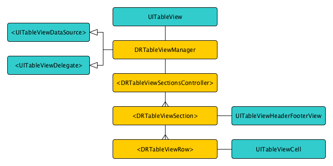

# DRTableViewManager (iOS)

Simple wrapper around `UITableViewDataSource` and `UITableViewDelegate` protocols that allows easy `UITableView` content configuration using blocks or custom objects representing sections and rows. 

General logic behind `DRTableViewManager`:

- `DRTableViewManager` - implements `UITableViewDataSource` and `UITableViewDelegate` protocols, owns `DRTableViewSectionController`
- `DRTableViewSectionController` - defines sections (`DRTableViewSection`) for given table view
- `DRTableViewSection` - represents table view section, defines rows (`DRTableViewRow`) for that section
- `DRTableViewRow` - represents table view row, defines cell (`UITableViewCell`) for that row



Full `UITableViewDataSource` and `UITableViewDelegate` protocols are supported. For example, `DRTableViewSection` also defines section's header and footer (as well as their heights), and `DRTableViewRow` defines `UITableViewCell` height, didSelect action etc.

In addition, `DRTableViewManager` was designed to allow using `UITableViewAutomaticDimension` cell height under iOS 7. Where on iOS 8 this feature is natively supported, for iOS 7 `DRTableViewManager` will take care on computing expected cell's height using AutoLayout automatically (see Example 2 for more details).

## Instalation

You can integrate `DRTableViewManager` with your project using Cocoapods. To do so, you will need to add one of the following lines to your Podfile:

For most recent or development version:

    pod 'DRTableViewManager', :git => 'https://github.com/darrarski/DRTableViewManager-iOS.git'

For specific version:

    pod 'DRTableViewManager', :git => 'https://github.com/darrarski/DRTableViewManager-iOS.git', :tag => 'VERSION_TAG'

Where `VERSION_TAG` you should put tag name for given version (ex. "v1.0.0"). It is recommended to set version explicity instead of using most recent version, as backward compatibility is not warranted.

You can also download zip archive of given release from [releases page](https://github.com/darrarski/DRTableViewManager-iOS/releases).

## Usage

Check out included example project.

### Example 1

Shows basic usage, where sections and cells are statically defined in arrays.

### Example 2

Shows basic usage as well, but configures automatic cell heights basing on their content. Works for both iOS 8 (using native `UITableViewAutomaticDimension`) and iOS 7 (computes height with AutoLayout - see source code for details).

### TL;DR

Example usage:

```objective-c
DRTableViewGenericSectionsController *sectionsController = [[DRTableViewGenericSectionsController alloc] init];
sectionsController.sectionsCountBlock = ^NSInteger {
    return 3;
};
sectionsController.sectionAtIndexBlock = ^NSObject <DRTableViewSection> *(NSInteger sectionIndex) {
    return [DRTableViewGenericSection createWithBlock:^(DRTableViewGenericSection *section) {
        section.tableViewTitleForHeaderInSectionBlock = ^NSString *(UITableView *tableView, NSInteger tableSectionIndex) {
            return [NSString stringWithFormat:@"Section %ld", (long)tableSectionIndex];
        };
        section.tableViewHeightForHeaderInSectionBlock = ^CGFloat(UITableView *tableView, NSInteger tableSectionIndex) {
            return 30;
        };
        section.tableViewNumberOfRowsInSectionBlock = ^NSInteger(UITableView *tableView, NSInteger tableSectionIndex) {
            return 3;
        };
        section.rowAtIndexBlock = ^NSObject <DRTableViewRow> *(NSInteger rowIndex) {
            return [DRTableViewGenericRow createWithBlock:^(DRTableViewGenericRow *row) {
                row.tableViewHeightForRowAtIndexPathBlock = ^CGFloat(UITableView *tableView, NSIndexPath *indexPath) {
                    return 44;
                };
                row.tableViewCellForRowAtIndexPathBlock = ^UITableViewCell *(UITableView *tableView, NSIndexPath *indexPath) {
                    UITableViewCell *cell = [[UITableViewCell alloc] init]; 
                    cell.textLabel.text = [NSString stringWithFormat:@"Row %ld", (long)indexPath.row];
                    return cell;
                };
            }];
        };
    }];
};
_tableViewManager = [[DRTableViewManager alloc] initWithSectionsController:sectionsController];
[_tableViewManager registerInTableView:self.tableView];
```

## Changelog

##### v1.0.5

> Added `tableView:cellForComputingRowHeightAtIndexPath:` method to `DRTableViewRow` protocol for supporting `UITableViewAutomaticDimension` cell height under iOS 7

> Added `tableView:configureCell:forRowAtIndexPath:` method to `DRTableViewRow` protocol

> Examples updated

##### v1.0.4

> Deployment target changed to iOS 7.0, `DRTableViewManager` is compatible with both iOS 7 and iOS 8.

> Added Example 2 that shows how to implement automatic cell heights that works natively on iOS 8, but also on iOS 7 with some additional code.

##### v1.0.3

> Fixed - wrong method called on `DRTableViewRow` object for `tableView:heightForRowAtIndexPath:` method from `UITableViewDelegate` protocol

##### v1.0.2

> Fixed invalid protocol compliance definitions for arrays

##### v1.0.1

> Minor fixes

##### v1.0.0

> Inital release, supports iOS 8

## License

The MIT License (MIT) - check out included [LICENSE](LICENSE) file

